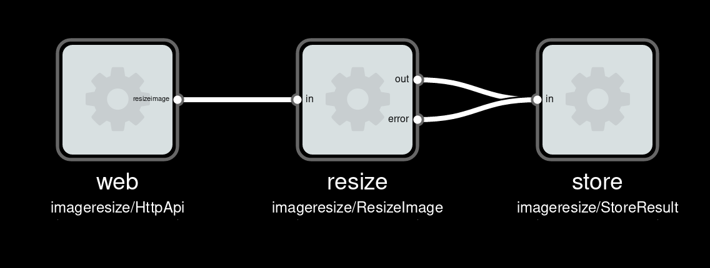

# MsgFlo example: Image resizing service

Example of how to build a backend service for CPU-intensive tasks using [Msgflo](https://msgflo/org).

## Deploying to Heroku

## API

* API. HTTP POST. JSON body. Array of images. URL and desired height/width. Returns 202 Accepted, with `Location`.
Ref. https://benramsey.com/blog/2008/04/http-status-201-created-vs-202-accepted/
* Downloads image. Rescales. Uploads downscaled. Updates job status.

## Status
**Work-in-progress**

## TODO

Minimal

* Add checks for successful job completion test
* Test with GuvScale

Bonus

* Script for querying processing times
* Fix marking job status with completed
* Heroku Button support
* Allow hosting `store` inside `web` worker
* Tools for summarizing/visualizing performance
* UI: Accept URLs

## Docs

Run performance tests of different architectures.

* Syncronous HTTP request-response
* Everything-in-web-role
* Dedicated worker
* Dedicated worker with autoscaling

## Running locally

### Prerequisites

The following software needs to be preinstalled

* Node.js 6+
* Postgres 9.6+
* RabbitMQ 3.6+

Also needed is an Amazon S3 bucket, and the associated credentials.

### Download git repo

    git clone https://github.com/msgflo/msgflo-example-imageresize.git
    cd msgflo-example-imageresize

### Install

    npm install

### One-time setup

Create the database

    psql -c 'create database imageresize_test;' -U postgres

Run database migrations and bind message queues

    npm run setup

### Configure

Configure Amazon S3 access

    export IMAGERESIZE_S3_KEY=key
    export IMAGERESIZE_S3_SECRET=secret
    export IMAGERESIZE_S3_BUCKET=bucket

### Run

Run the entire service

    npm start

### Run tests

    npm test

